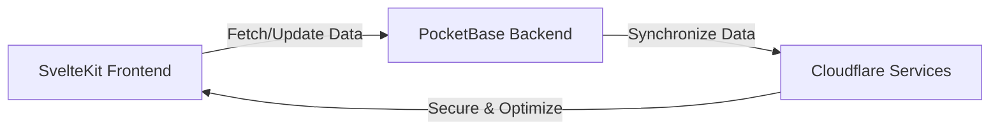

# HomeHive 🐝🏠

Welcome to HomeHive, the AI-powered home inventory tracking app that makes organizing your household items a breeze! 🌬️📦

## Overview 🌐

HomeHive helps you discover what's hidden in your home, manage your belongings during a move, and replaces tedious manual lists with a smart, AI-driven inventory management system. 📝🐝

## Architecture 🏗️

## Features 📋

- [x] Create a new inventory
- [ ] Add items to an inventory

## Development 🛠️

